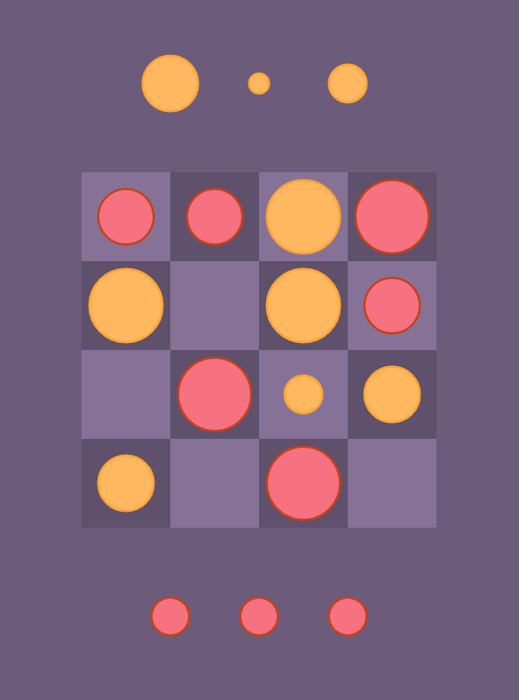

# WebAssembly Gobblet

This is a simple game called [Gobblet](https://en.wikipedia.org/wiki/Gobblet) built using Rust and WebAssembly

## Setup

A simple 'yarn' and 'yarn start' should do the trick. File an issue if it doesn't!

Open up the console to see who wins the game. 

